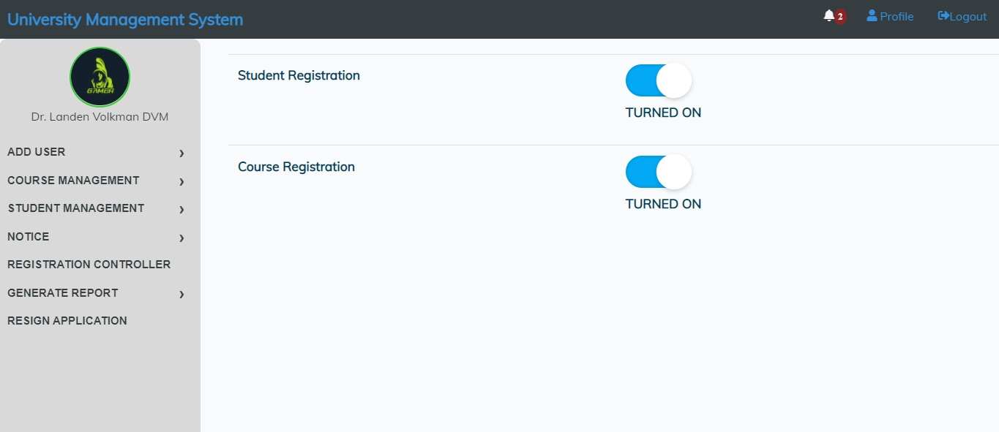

### UNIVERSITY MANAGEMENT SYSTEM APP

### Front-End and Backend Laravel

### MVC FOLLOWED

### LOGIN PAGE

### AdminDashboard

### Registration Page

### Profile

### Subject Adding Page

### Notice Adding Page

### Registration Control Page

### Resign Management Page

### Report Generation Page

### Sample Report in PDF

